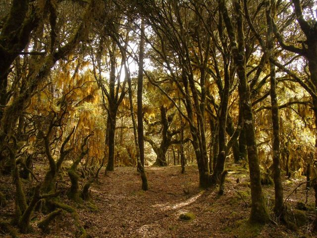

# *Quercus macdougallii*: functional genomics and its association with environmental variables
---
> # *************** **UNDER CONSTRUCTION** ****************
---

In this repository you can find some analysis of population genomics, potential distribution and the identification of *outliers SNPs* in candidate genes to local adaptation for an oak endemic to México.

---

<H1 align=center> GENERAL REPOSITORY STRUCTURE
</H1>  
  

- [**info_project**](/info_project)
- [**data**](/data)
- [**metadata**](/metadata)
- [**bin**](/bin)
- [**output**](/output)

---

##  DETAILED REPOSITORY STRUCTURE 

## [info_project](/info_project)  

**Information about this project:** This work will constitute the first step to study the local adaptation in candidate genes associated with certain environmental variables (clime and soil) in natural populations of an oak endemic to Oaxaca, México, **_Quercus macdougallii_**. This could help to detect geographic patterns of functional genomic variation and improve conservation plans for the species. 

  Overall objective for this project: 
  - Analyze the functional genomic variation of *Quercus macdougallii* to identify genes associated with environmental variables
  
  Specific objectives for this project:
  - 1.- Identify outlier SNPs that are in coding regions
  - 2.- Analyze this set of outlier SNPs with multivariate models to detect the presence of correlations between this and a set of environmental variables.
  - 3.- Validate the expression of candidate genes identified through analysis of differential expression.

For more information go to [info_project/README.md](info_project/README.md)

---
## [**data**](/data) 

**(IN PROCESS UNTIL PUBLICATION)**

This directory will contain the data for genomic and environmental analyzes (climate and soil). 

 - **genomic** : This directory contains sequences of candidate genes for local adaptation previously identified in the literature and the sequences obtained from the work of [Pacheco-Cruz, 2019](http://oreon.dgbiblio.unam.mx/F/X3YHJ1BNV7S4YYHEPDPIIA1S4GF2I5UGQMS61QGRFB4AHKPCJ7-04791?func=full-set-set&set_number=023823&set_entry=000002&format=999). As well as the VCF file (variant call format) of the identified SNPs.
 
   *snps_qmacd.vcf*

 - **climate** : Which contains the *shapes* and data of three main public databases to use.
    - *wc* : Contains the layers of the [WorldClim site](https://www.worldclim.org/) with data for the current scenario and four scenarios under the effects of climate change.*actual, 2050_4.5, 2050_8.5, 2070_4.5, 2070_8.5*
        
BIO1 = Annual Mean Temperature
BIO2 = Mean Diurnal Range (Mean of monthly (max temp - min temp))
BIO3 = Isothermality (BIO2 / BIO7) (× 100)    
BIO4 = Temperature Seasonality (standard deviation × 100)   
BIO5 = Max Temperature of Warmest Month   
BIO6 = Min Temperature of Coldest Month   
BIO7 = Temperature Annual Range (BIO5-BIO6)   
BIO8 = Mean Temperature of Wettest Quarter    
BIO9 = Mean Temperature of Driest Quarter   
BIO10 = Mean Temperature of Warmest Quarter   
BIO11 = Mean Temperature of Coldest Quarter   
BIO12 = Annual Precipitation   
BIO13 = Precipitation of Wettest Month   
BIO14 = Precipitation of Driest Month   
BIO15 = Precipitation Seasonality (Coefficient of Variation)    
BIO16 = Precipitation of Wettest Quarter   
BIO17 = Precipitation of Driest Quarter   
BIO18 = Precipitation of Warmest Quarter   
BIO19 = Precipitation of Coldest Quarter
     
- *conabio* : Contains the files in .shape format, obtained from the CONABIO portal http://geoportal.conabio.gob.mx/

EXL = Existence of firewood in Mexico at the municipal level   
EXP = Exposure   
PRE = Average annual precipitation   
RHS = Soil moisture regimes   
ACE = Modified specific catchment area (accumulation of water due to surface runoff)   
PDT = Pending   
EDA = Edaphology (soil type)   
ELE = Digital Elevation Model   
HGE = Hydrogeology (water retention capacity, through porosity and permeability of the soil and subsoil)   
TEM = Annual mean temperature
 
 - *soil*    : Contains the data of the analyzed variables (content of C, P, N)

---        
## [**metadata**](/metadata)

This directory contains the `.csv` file of geographical coordinates, altitude and the site where each of the 80 individuals were collected and analyzed in the work of [Pacheco-Cruz, 2019](http://oreon.dgbiblio.unam.mx/F/X3YHJ1BNV7S4YYHEPDPIIA1S4GF2I5UGQMS61QGRFB4AHKPCJ7-04791?func=full-set-set&set_number=023823&set_entry=000002&format=999).

[**metadata_qmacd.csv**](/metadata/ind_qmacd.csv)

---

## [**bin**](/bin)

This directory contains the scripts used to perform the analysis of functional genomics and its association with environmental variables (climate and soil) for *Q. macdugallii*.

**1. Genomic analysis**  
[1.0_genomic_analysis.R](/bin/1.0_genomic_analysis.R)
   
**2. Environment analysis**     
[2.0_environment_analysis.R](bin/2.0_environment_analysis.R)   
[2.1_clean_data.R](bin/2.1_clean_data.R)   
[2.2_value_extraction.R](bin/2.2_value_extraction.R)   
[2.3_correlation.R](bin/2.3_correlation.R)   

**3. GradientForest**  
[3.0_gradientForest.R](bin/3.0_gradientForest.R)   
[3.1_all_SNPs.R](bin/3.1_all_SNPs.R)   
[3.2_clim_associated_SNPs.R](bin/3.2_clim_associated_SNPs.R)   
[3.3_temp_associated_SNPs_all_clim_var.R](bin/3.3_temp_associated_SNPs_all_clim_var.R)

---

## [**output**](/output)

Contains the figures generated from the scripts and the data, as well as a final report of everything obtained.

---

  
