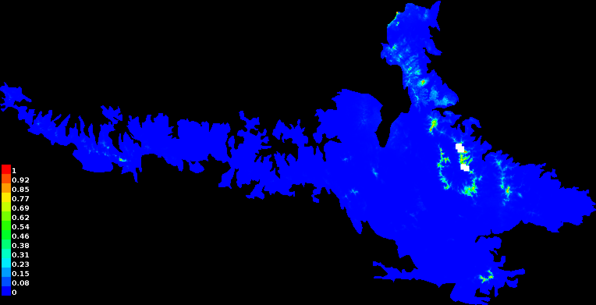

Workflow for the analysis of genomics populations and environmental variables for *Quercus macdougallii* under construction

## Identification of SNPs outliers

First we need to load the VCF file and the metadata, also we need to convert ths VCF file to genlight and genind objects

```{r message=FALSE, warning=FALSE, include=FALSE}
source("../bin/1.1_load_databases.R", echo = F)
```

Then we can plot a distances tree [1.2\_distances\_tree.R](../bin/1.2_distances_tree.R)

```{r}
### Distance tree

tree <- aboot(snps_genlight_sites, tree = "nj", 
              distance = bitwise.dist, sample = 50, 
              showtree = F, cutoff = 50, quiet = T)

# And if we want to write the file to export in .tre format (Newick file format) so we can visualize in Geneious also
write.tree(tree, file = '../results/databases/tree_glfts_2pop_2pop_79.2.tre') 

```

To plot the distances tree

```{r}

cols <- c("#7570B3", "#075277","#00B1E8","#1FC944",
          "#E6AB02", "#E7298A","#E07E34", "#F15858")

plot.phylo(tree, type = "cladogram", use.edge.length = T, rotate.tree = 170, 
           edge.color = "black", node.pos = 2, 
           show.tip.label = TRUE, edge.width = 1, cex = .6, font = 1, 
           tip.color =  cols[pop(snps_genlight_sites)], no.margin = F)
#######Extra
nodelabels(tree$node.label, adj = c(0.1, -0.5), frame = "n", cex = 0.6,font = 1, xpd = TRUE)
legend("topright", legend = c("Comaltepec-Yolox","Ixtlán"), fill = cols, border = FALSE, bty = "n", cex = 0.3)
axis(side = 1)
title(xlab = "Distancia genética (proporción de loci que son diferentes)", cex=0.5 )

```

And to make a Tree of distances by sites

```{r}

# Tree of distances by sites
#Change site levels to two POPs
#glnew <- gl.edit.recode.pop(snps_genlight_sites)
#levels(pop(glnew))

# Tree based on neighbor joining NJ, summarizing genetic similarity between sites
tree_sitios_79.1 <- gl.tree.nj(snps_genlight_sites, type="fan")
tree_sitios_79.1
#Export the tree in .tre format to open it in Geneious
#write.tree(tree_sitios_79.1, file = 'tree_sitios_79.2.tre')

```

```{r}
source("../bin/1.3_PCoA.R", echo = T)
```

### Minimum spanning network (MSN)

We can create a minimum spanning network (MSN) of selected populations using a distance matrix. <https://grunwaldlab.github.io/Population_Genetics_in_R/Minimum_Spanning_Networks.html>

```{r}
source("../bin/1.4_MSN.R", echo = T)
```

In the minimal expansion network analysis, where the visualization of relationships between individuals based on genetic distances was optimized, no clonal individuals were identified. Likewise, it is observed that the individual CR\_16 connects two branches that are formed between individuals from the South. On the other hand, it is observed that certain individuals from the South zone have closer genetic distances to other individuals from the North zone. For example, individuals CR\_19, LS\_26, LS\_28 and LS\_29 are grouped at one end of the network, closer to individuals from the MT site, while individuals PZ\_01, PZ\_02 and PZ\_03 are located closer to the MC and MB sites .

### For Principal Component Analysis

```{r}
source("../bin/1.5_PCA.R", echo = F)
```

In the PCA, a tendency of separation is observed between the individuals of the North zone and those of the South. While the individuals from the North zone are strongly grouped among themselves, those from the South zone are dispersed. On the other hand, the first CP clearly separates individuals from the North zone, also grouping individuals LS\_26, LS\_28, LS\_29 and CR\_19 from the South zone. These same individuals are also isolated by the second CP along with others from the MC and CZ sites.

### The analysis of DAPC

```{r}
source("../bin/1.6_DAPC_SNPs_structure_plot.R", echo = T)
```

In SNP 3, a fluctuation in allele frequencies is observed between the sites in the North and South zones. While in the North zone only one allele is observed for the SNPs, cytosine, in the South zone the presence of another allele, adenine, is observed.

In SNP 5, only in the CR and PZ sites, both in the southern zone, SNPs with changes of two alleles, guanine and cytosine, are observed, while in the other sites, this SNP is only found with the cytosine allele.

*In the eight SNPs outliers a differentiation trend was observed between the two zones, being very clear in the two transversions. Due to this and considering that in the South zone it is possible that there is an incipient genetic group for the species, we could point out that, in the South zone sites, especially in PZ and CR, it is where the new alleles have been presented. for these SNPs outliers, which only present one allele in the northern zone sites. Therefore, these SNPs outliers could be interesting candidates for functional genomics studies.*

## Analysis of environment variables

Below are the steps for the analysis of the environmental variables obtained in WorldClim, as well as the selection of the environmental variables with the lowest correlation for downstream analysis.

For this analysis the libraries were used:

|                               |
|-------------------------------|
| install.packages ("raster")   |
| install.packages ("sp")       |
| install.packages ("usdm")     |
| install.packages ("corrplot") |

The 19 current environmental variables were obtained from the [WorldClim portal](https://www.worldclim.org/)

First we need to clean the data wich is remove spatially repeated data in a radius of 1km2. This is in the script [**2.1\_clean\_data.R**](../bin/2.1_clean_data.R)

```{r}
source("../bin/2.1_clean_data.R", echo = T)
```

Then, from the database of the clean points, we will proceed to extract the values of the 19 climatic variables for each of the presence points with which we are left, for that we use the script [**2.2\_values\_extraction.R**](../bin/2.2_values_extraction.R).

```{r}
source("../bin/2.2_values_extraction.R", echo = T)
```

Finally, from the generated database we make a correlation analysis as well as a plot, we also use the variance inflation value (VIF) to select the variables with the lowest collinearity values for the subsequent analysis of modeling of niche.

[**2.3\_variable\_correlation.R**](../bin/2.3_variable_correlation.R)

```{r}
source("../bin/2.3_variable_correlation.R", echo = T)
```

To find out which ones to remove using the Variance Inflation Factor (VIF). If VIF\> 4.0 implies multicollinearity, these variables must be removed. However, some authors recommend that it is fine with VIF values\> 10 [Montgomery and Peck (1992)], this suggests that the collinearity between these variables is no longer a problem.

Other authors suggest that it should ideally be less than 1.5, see Zuur et al. 2009. Mixed Effects Models and Extensions in Ecology with R. pp. 478 for references.

## MaxEnt

To use MaxEnt Copy and paste this line in your console from /bin/ directory

```{bash}
java -mx512m -jar maxent/maxent.jar -e ../metadata/climate/wc/actual/ -s ../metadata/quercus_geog_todos_puntos.csv -o ../results/niche_model_WC_actual/ -r -a
```


