## Tutoral 1

## Análisis de la variación genómica funcional y su asociación con variables ambientales en _Quercus macdougallii_ Martínez (Fagaceae), encino endémico de Oaxaca.

<p align="center">

</p>


### Alumna: Nelly Jazmín Pacheco Cruz

### Tutor principal: Dr. Jorge E. Campos Contreras
### Miembros del Comité Tutor:
### - Dr. Jorge Ciros Pérez 
### - Dr. Juan P. Jaramillo Correa

* * *
# 1. Introducción 

## Los bosques templados

- Importantes reservorios de biomasa y biodiversidad

- Servicios ecológicos

- Patrimonio biocultural

([Cavender-Bares, 2016](https://www.cbs.umn.edu/sites/cbs.umn.edu/files/public/downloads/2016.cavender.journal.ios%2327.pdf); [Cavender-Bares, 2019](https://nph.onlinelibrary.wiley.com/doi/full/10.1111/nph.15450))

<p align="center">

</p>


Adaptación de especies arbóreas frente al Cambio Climático ([IPCC, 2007](https://www.ipcc.ch/report/ar4/syr/))

* * *
## Encinos

 - A nivel mundial se estiman entre 400 y 500 especies.
<p align="center">

</p>

Distribución geográfica de las ocho secciones del género *Quercus* ([Denk *et al.,* 2017](https://link.springer.com/chapter/10.1007/978-3-319-69099-5_2)).

- México es considerado uno de los más grandes centros de diversificación del género.
- Se estiman 150 especies aprox.
- Con 76 especies endémicas aprox.
- Oaxaca es consierado un hotspot

<p align="center">

</p>


* * *
## *Quercus macdougallii* Martínez (1963)

```
├── Orden: Fagales
│   └── Familia: Fagaceae
│         └── Género: Quercus  
│               └── Subgénero: Quercus
│                      └── Sección: Quercus (encinos blancos)
│                              └── Especie: Q. macdougallii
```
Nombres comunes en la zona donde se distribuye:

- **_Yaa dua yu_** ( Zapoteco)  
- **_’Ma kue_** (Chinanteco)

Encino endémico en peligro ([UICN, 2020](https://www.iucnredlist.org/es/species/32765/2823034)) y amenazado ([NOM-059, 2019](http://diariooficial.gob.mx/normasOficiales.php?codp=8007&view=si#)).

<p align="center">

</p>

Individuos adultos de _Q. macdougallii_: a) Hojas de un individuo adulto; b) Hojas de un individuo con características arbustivas en el sitio MC; c) Hojas con evidencia de herbivoría; d) Individuos adultos en el sitio PZ (aprox. 15 m de altura); e) Individuo con apariencia arbustiva en el sitio CZ (aprox. 3 m de altura); f) Individuo adulto en el sitio MB cubierto de musgos y epífitas.


<p align="center">

</p>

Presenta una distribución restringida a la Sierra Norte de Oaxaca,  también conocida como Sierra Juárez ([Valencia, 2004](https://www.botanicalsciences.com.mx/index.php/botanicalSciences/article/view/1692); [Romero-Rangel _et al.,_ 2015](https://www.iztacala.unam.mx/coordinacioneditorial/vinculos/servicio/libreria/catalogo.php#indice)).

* * *
# 2. Antecedentes


[Martínez, _et al.,_ 2018. Landscape genomics provides evidence of climate‐associated genetic variation in Mexican populations of _Quercus rugosa_](https://onlinelibrary.wiley.com/doi/full/10.1111/eva.12684)

En México, este enfoque se ha utilizado para identificar la variación genómica que puede conferir adaptaciones locales a Q. rugosa, una especie de amplia distribución, así como la predicción del desajuste adaptativo bajo los cambios climáticos futuros. Mediante el uso de la GBS, se identificaron 5,354 SNPs, a partir de 103 individuos analizados, de 17 sitios de muestreo. El valor de FST entre los SNPs fue de 0.056, y varió de 0.037 a 0.095 entre los sitios de muestreo, la He promedio fue de 0.364. Se observó un patrón de aislamiento por distancia con la prueba de Mantel (r=0.475, p-valor=0.015). El agrupamiento Bayesiano implementado en STRUCTURE identificó un K=2 y la distribución de este agrupamiento en el paisaje muestra un gradiente entre este y oeste. Se identificaron 74 SNPs outliers, los cuales presentaron valores de 0.165 a 0.314, y 97 SNPs asociados con la variación del clima. Se identificaron patrones espaciales de variación genética con una fuerte asociación con la estacionalidad de la precipitación y con las distancias geográficas. En conjunto, con los análisis de distribución futura, se pronosticaron regiones donde las poblaciones de Q. rugosa, podrían estar en riesgo debido al cambio climático (Martins et al., 2018).


De la especie:

Los estudios reportados hasta ahora acerca de Q. macdougallii, se han enfocado en la zona Norte de su distribución conocida y la mayoría se han centrado en su ecología. En esta zona se han registrado eventos de perturbación antropogénica cercanos a la especie, lo cual influye en la tasa de supervivencia de las plántulas, reportándose diferencias entre sitios con y sin disturbio (10% y 75% respectivamente) (Pariona et al., 2017; Clark-Tapia et al., 2018).
También, se ha observado una distribución agregada de la especie, un número poblacional bajo, una regeneración escasa, una baja tasa de germinación y diferencias significativas en la abundancia de sus individuos entre sitios de muestreo ubicados en la zona Norte, así como entre diferentes niveles de altitud (msnm). Asimismo, se ha sugerido que la altitud y el tipo de suelo pueden afectar considerablemente su distribución (Anacleto-Carmona, 2015).
Por otro lado, mediante el análisis de modelos generalizados lineales y no lineales, se han identificado una serie de variables ambientales que pueden influir ampliamente en la abundancia de la especie. Al considerar a las covariables, se identificó a las temperaturas máximas y mínimas, así como a la precipitación durante periodos de tiempo específicos. Por medio de los modelos aditivos generalizados (GAM) simples, se identificó a la temperatura media en el mes más frío, la temperatura media en el mes más cálido y la precipitación promedio en primavera (abril y mayo). Mientras que los GAM múltiples, identificaron a la pendiente media del terreno, el aspecto dominante del sitio (cenit, noreste, este, sureste, sur, suroeste, oeste, noroeste y norte), la elevación sobre el nivel del mar y la duración media del período libre de heladas (Antúnez et al., 2017).

El único estudio acerca de su variación genética, identificó 26 alelos mediante el uso de tres microsatélites de la serie quruGA, y reportó una baja variabilidad genética (Ho=0.402; He=0.557) y una baja estructura genética (FST=0.021), lo cual, sugiere un alto flujo génico entre los sitios muestreados y un posible evento reciente de cuello de botella génico (Molina-Garay, 2011).

* * *
# 3. Justificación

<p align="center">

</p>

(Rellstab _et al.,_ 2016; Sork _et al.,_ 2016a; Sork _et al.,_ 2016b; Gugger _et al.,_ 2017; Pina-Martins _et al.,_ 2019).

<p align="center">
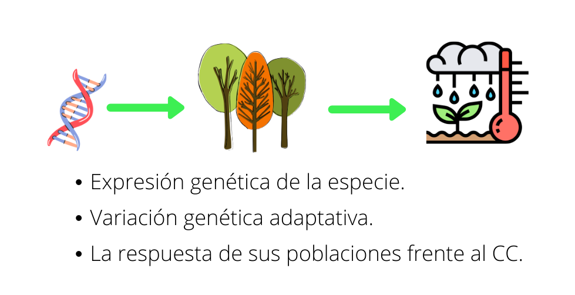
</p>

(Müller y Gailing, 2019; Yang _et al.,_ 2018).


* * *
# 4. Hipótesis


En especies arbóreas de vida larga se han reportado genes asociados a una respuesta adaptativa frente a cambios climáticos, por lo cual, se espera que _Q. macdougallii_, encino endémico, presente genes asociados a variables ambientales, como la temperatura, la precipitación y la edafología.


<p align="center">
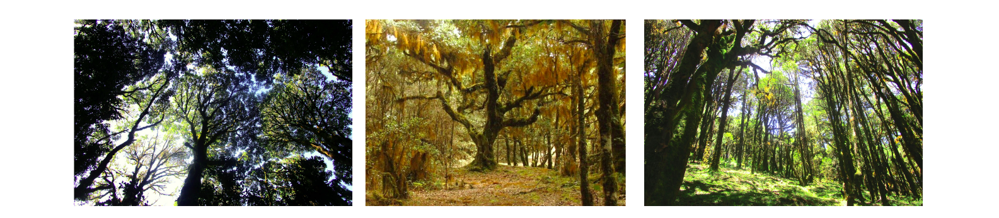
</p>


* * *
# 5. Objetivos

<p align="center">
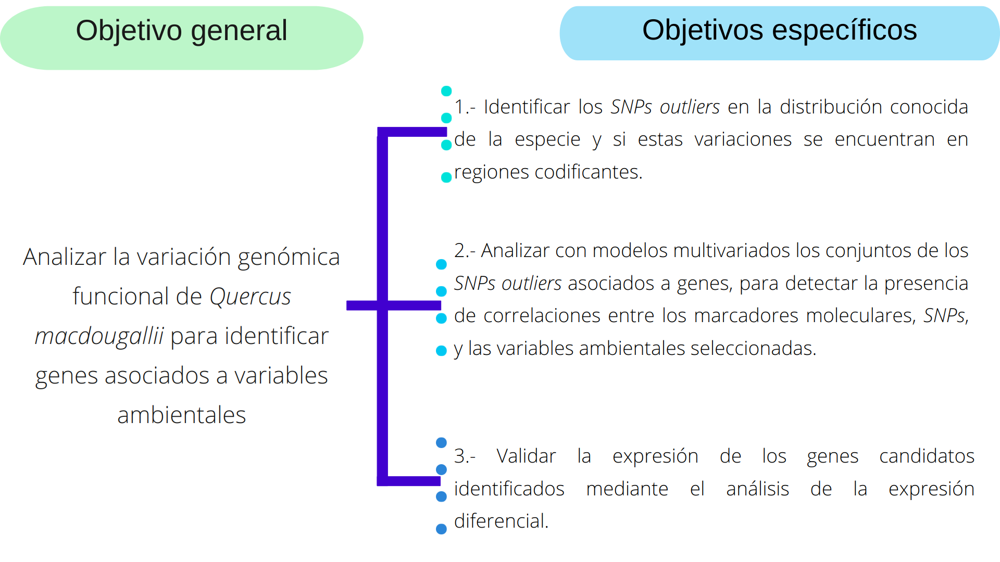
</p>

* * *
# 6. Materiales y métodos

### Área de estudio


|| |
|--------|--------|
|<p align="center">  </p>| <p align="center"> 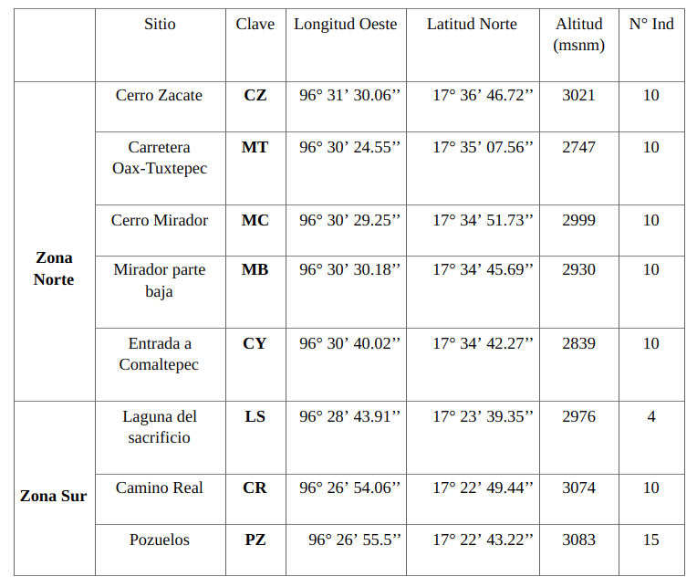 </p>|

Esta área se encuentra en una zona de transición entre dos provincias biogeográficas, la Sierra Madre del Sur y la Provincia de Oaxaca.


<p align="center">
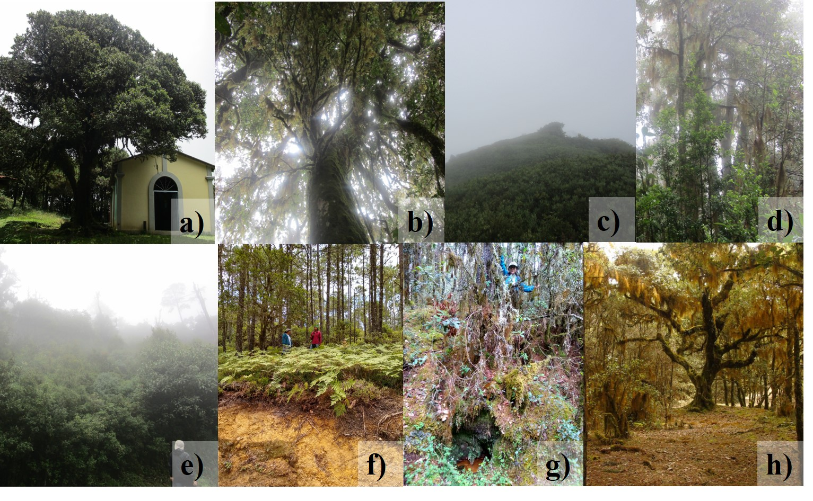
</p>

Sitios de muestreo: a) Cerro Zacate; b) Carretera Oaxaca-Tuxtepec Km 175; c) Cerro Mirador; d) Parte baja del Cerro Mirador; e) Entrada a Comaltepec a partir de la Carretera Federal Oaxaca-Tuxtepec; f) Laguna del Sacrificio; g) Camino Real; h) Pozuelos.

- - -
### Diagrama de flujo general

<p align="center">
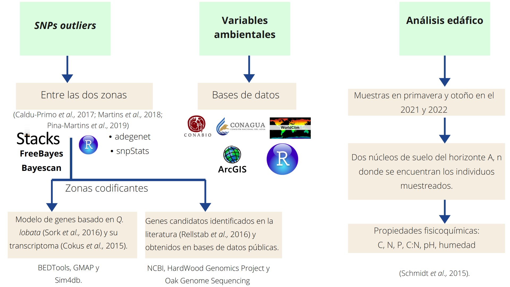
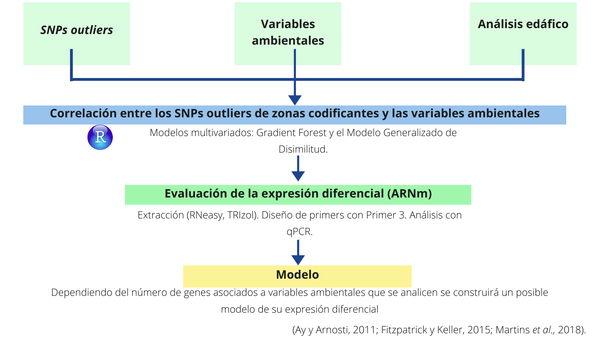
</p>

([Ay y Arnosti, 2011](https://www.tandfonline.com/doi/abs/10.3109/10409238.2011.556597); [Cokus _et al.,_ 2015](https://bmcgenomics.biomedcentral.com/articles/10.1186/s12864-015-1761-4); [Fitzpatrick y Keller, 2015](https://onlinelibrary.wiley.com/doi/abs/10.1111/ele.12376); [Schmidt _et al.,_ 2015](https://www.sciencedirect.com/science/article/abs/pii/S0378112714006872); [Rellstab _et al.,_ 2016](https://onlinelibrary.wiley.com/doi/abs/10.1111/mec.13889); [Sork _et al.,_ 2016](https://academic.oup.com/g3journal/article/6/11/3485/6031119?login=true); [Caldu-Primo _et al.,_ 2017](https://www.frontiersin.org/articles/10.3389/fgene.2017.00045/full); [Martins _et al.,_ 2018](https://onlinelibrary.wiley.com/doi/full/10.1111/eva.12684); [Pina-Martins _et al.,_ 2019](https://onlinelibrary.wiley.com/doi/abs/10.1111/gcb.14497)).

 Fuentes de bases de datos:
 [NCBI:genoma de _Q. lobata_](https://www.ncbi.nlm.nih.gov/genome/44710)     
 [HardWood Genomics Project](https://hardwoodgenomics.org/bio_data/25)       
 [Oak Genome Sequencing](http://www.oakgenome.fr/)
 

### ++Ensambles e identificación de _SNPs outliers_++

<p align="center">
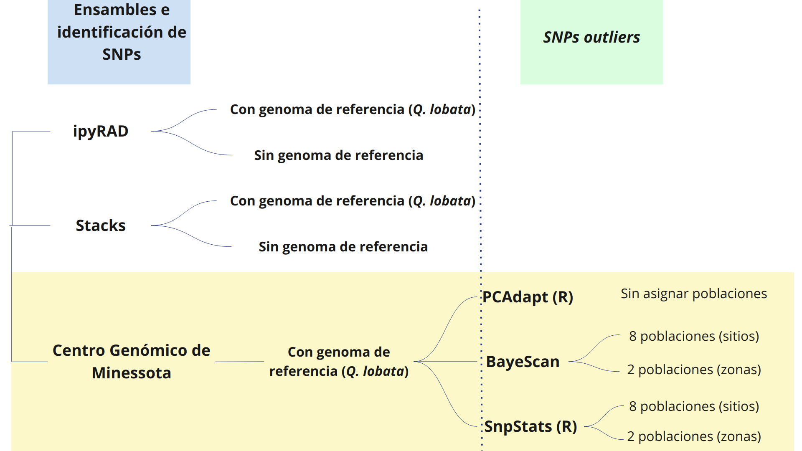
</p>

El análisis de visualización y limpieza de las secuencias de los 79 individuos ya se realizó con los programas FastQC y Trimmomatic. La bitacorá se puede consultar [aqui](../results/workflow_first_part.md).

El análisis con la _pipeline_ de **ipyRAD** esta en proceso, por el momento ya se hizo la [primer prueba](../results/Quercus_mac_lobata_ipyrad.md) con los parámetros de _default_ del programa y con el genoma de referencia de _Q. lobata_ encontrado en [HardWood Genomics Project](https://hardwoodgenomics.org/bio_data/25), y se han identificado 191,153 SNPs pero con bajas frecuencias, lo que procedería es hacer un filtro para excluir aquellos con altos niveles de _Ns_ o datos faltantes.


* * *
# 7. Resultados preliminares

PCAdapt
<p align="center">
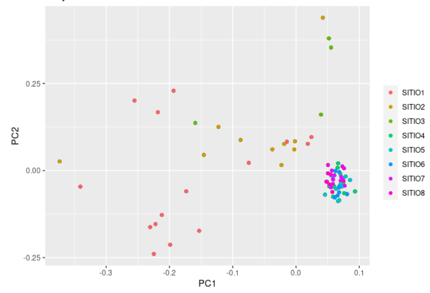
</p>


<p align="center">
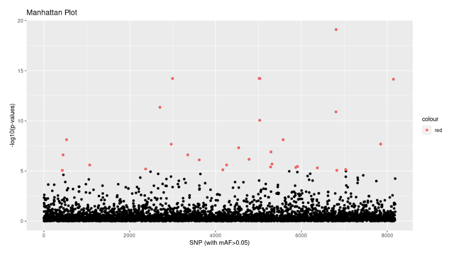
</p>


<p align="center">
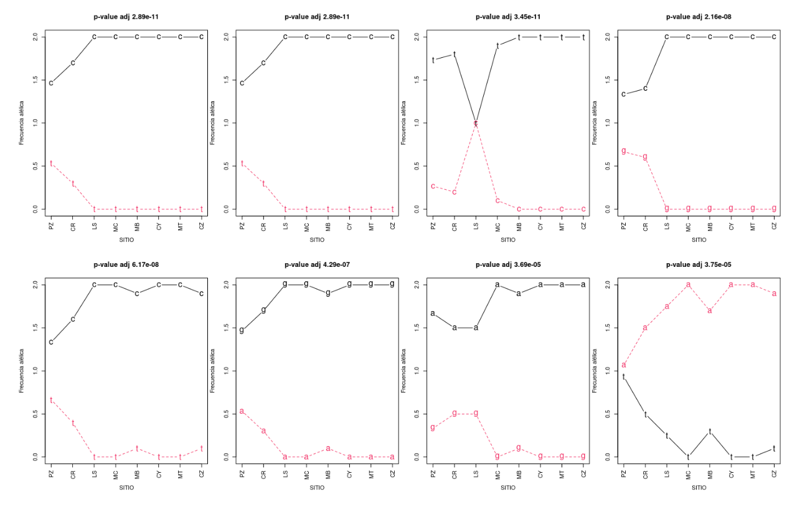
</p>


BayeScan
<p align="center">
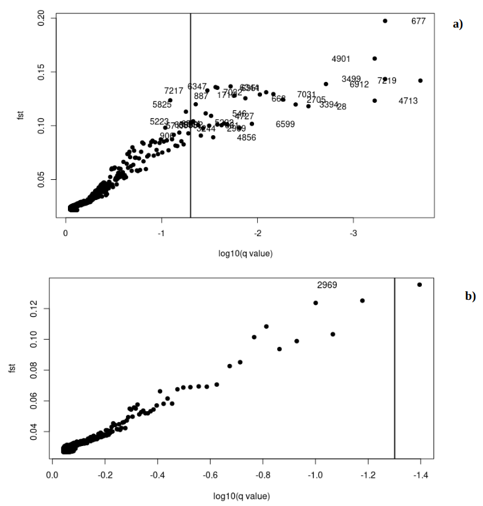
</p>


<p align="center">
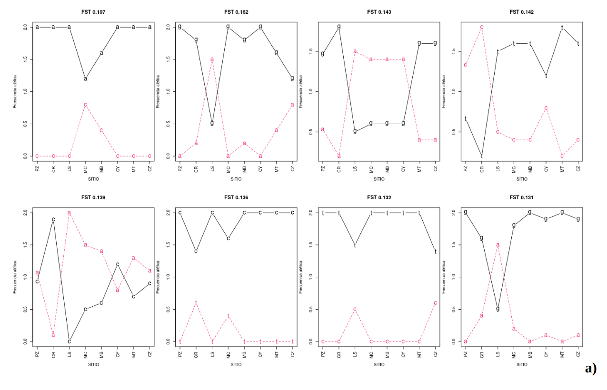
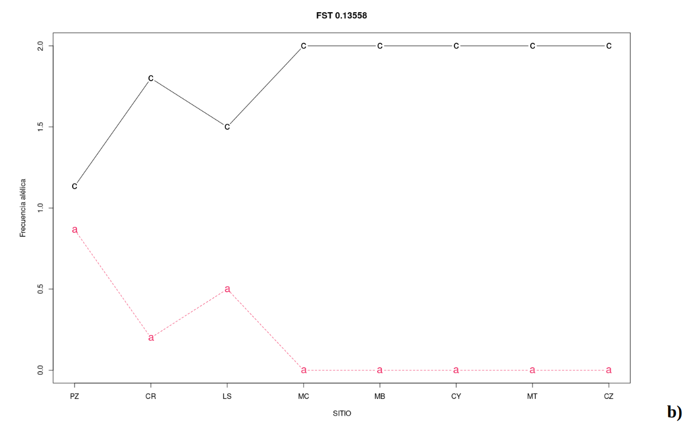
</p>

SnpStats

<p align="center">
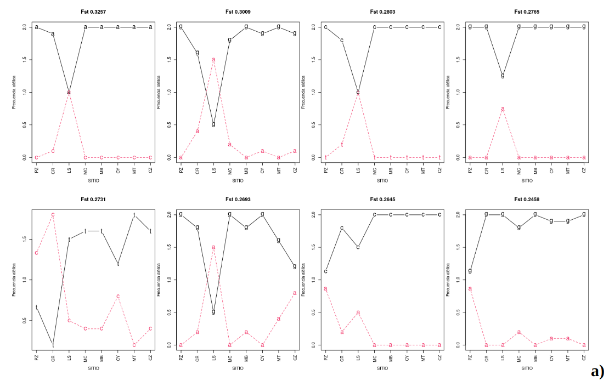
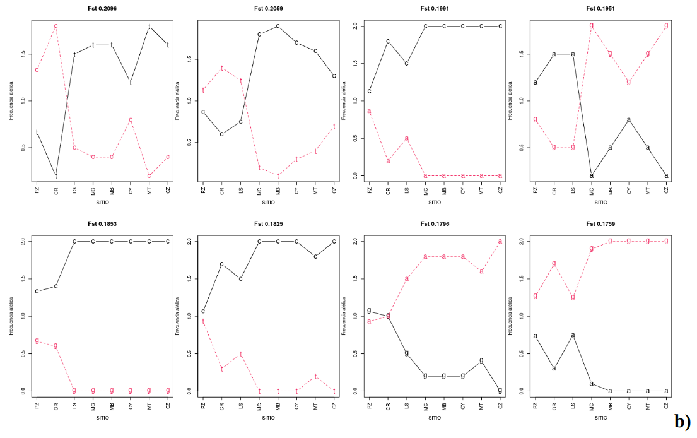
</p>


A partir de estos tres métodos se generaron cinco bases de datos con los ID de cada SNP outlier y a partir de un diagrama de Venn se identificaron cuantos de ellos se compartían entre las cinco bases de datos.


<p align="center">
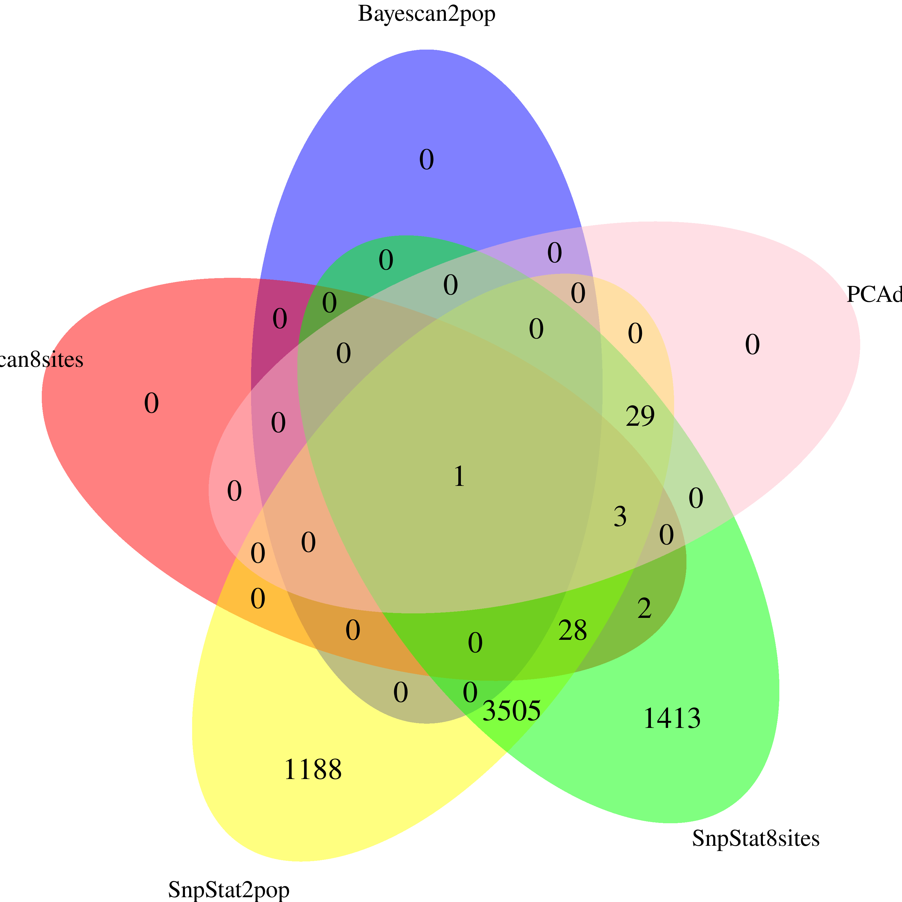
</p>

Diagrama de Venn entre las cinco bases de datos generadas en los tres métodos para identificación de SNPs outliers. 


El único SNP outlier que comparten las cinco bases de datos es el “SSCAFFOLD-14_28801306”, en donde se identificó el cambio entre citosina y adenina, el cual se ubica en la secuencia:
TATGTTTTTCAAGAATTTCAAACAATCTATTATCATTCAAAAAAGATAGAAAACGTATAGCTAGACTTCTTTCCTCCTCTGGCTTATCAAATGAAAGAGCMTTTTCTCCCATTAATAACTCTACGAGGACCACTCCAAAGCTATAAACATCACTTTTCTCTGTCAATTGACTTGTTTGCATGTATTCAGGATCCAAGTATC
Al hacer un BLAST se pudo identificar una similitud con el putativo receptor de quinasa asociado a pared 16 PREDICHO para Q. lobata (LOC115985898), mRNA
Sequence ID: XM_031108791.1Length: 2253
El cambio de entre citosina y adenina (C:A = M) puede afectar la traducción de prolina a histidina en esta región. 

Pendiente: Aún faltan más análisis para corroborar esto además del otro enfoque donde se buscará si en genes previamente identificados para otros encinos como genes candidatos a adaptación, hay variaciones identificadas en las secuencias de Q. macdougallii.

