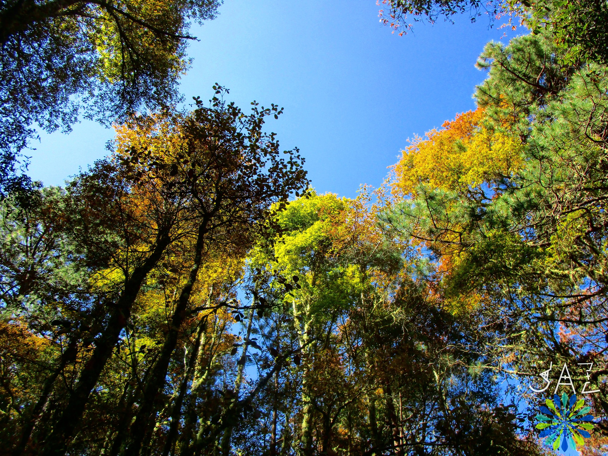
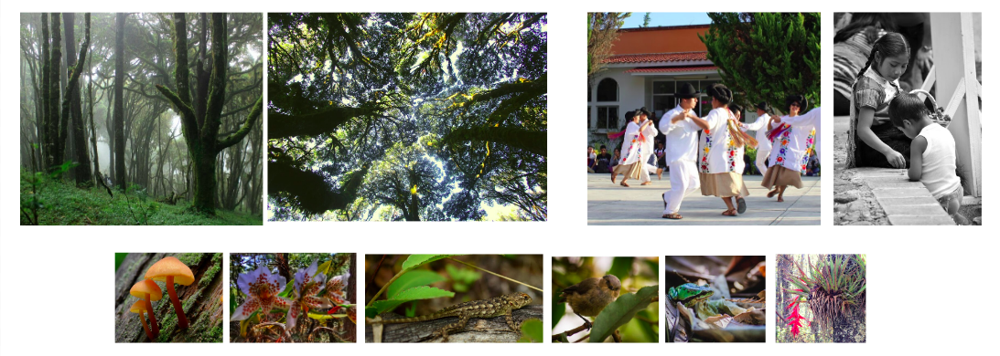
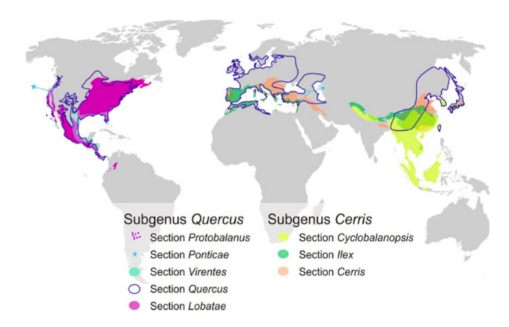
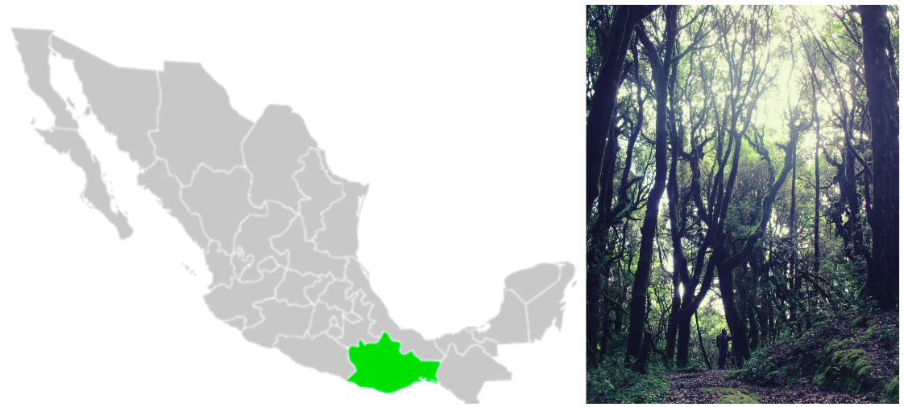
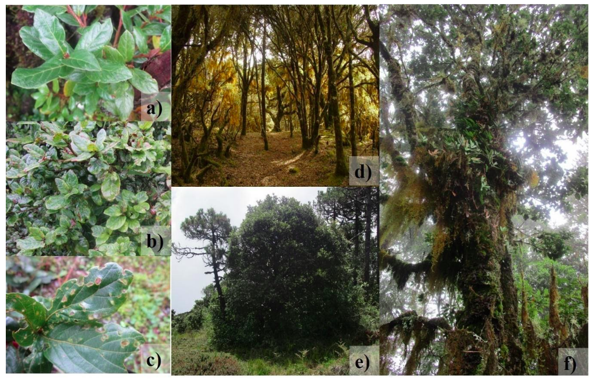

## Tutoral 1

## Análisis de la variación genómica funcional y su asociación con variables ambientales en _Quercus macdougallii_ Martínez (Fagaceae), encino endémico de Oaxaca.

### Alumna: Nelly Jazmín Pacheco Cruz

### Tutor principal: Dr. Jorge E. Campos Contreras
### Miembros del Comité Tutor:
### - Dr. Jorge Ciros Pérez 
### - Dr. Juan P. Jaramillo Correa

* * *
# Introducción y planteamiento del problema

* * *

## Los bosques templados

- Importantes reservorios de biomasa y biodiversidad

- Servicios ecológicos

- Patrimonio biocultural

([Cavender-Bares, 2016](https://www.cbs.umn.edu/sites/cbs.umn.edu/files/public/downloads/2016.cavender.journal.ios%2327.pdf); [Cavender-Bares, 2019](https://nph.onlinelibrary.wiley.com/doi/full/10.1111/nph.15450))

Adaptación de especies arbóreas frente al Cambio Climático ([IPCC, 2007](https://www.ipcc.ch/report/ar4/syr/))

* * *
## Encinos

 - A nivel mundial se estiman entre 400 y 500 especies.

Distribución geográfica de las ocho secciones del género *Quercus* ([Denk *et al.,* 2017](https://link.springer.com/chapter/10.1007/978-3-319-69099-5_2)).

- México es considerado uno de los más grandes centros de diversificación del género.
- Se estiman 150 especies aprox.
- Con 76 especies endémicas aprox.
- Oaxaca es consierado un hotspot

* * *
## *Quercus macdougallii* Martínez (1963)
Familia: Fagaceae
Género: Quercus
Subgénero: Quercus
Sección: _Quercus_ (encinos blancos)

**_Yaa dua yu_** ( Zapoteco)  
**_’Ma kue_** (Chinanteco)

Encino endémico en peligro (UICN, 2020) y amenazado (NOM-059, 2019).

Individuos adultos de _Q. macdougallii_: a) Hojas de un individuo adulto; b) Hojas de un individuo con características arbustivas en el sitio MC; c) Hojas con evidencia de herbivoría; d) Individuos adultos en el sitio PZ (aprox. 15 m de altura); e) Individuo con apariencia arbustiva en el sitio CZ (aprox. 3 m de altura); f) Individuo adulto en el sitio MB cubierto de musgos y epífitas.

