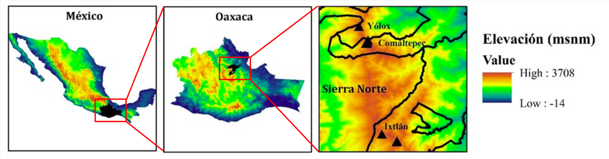
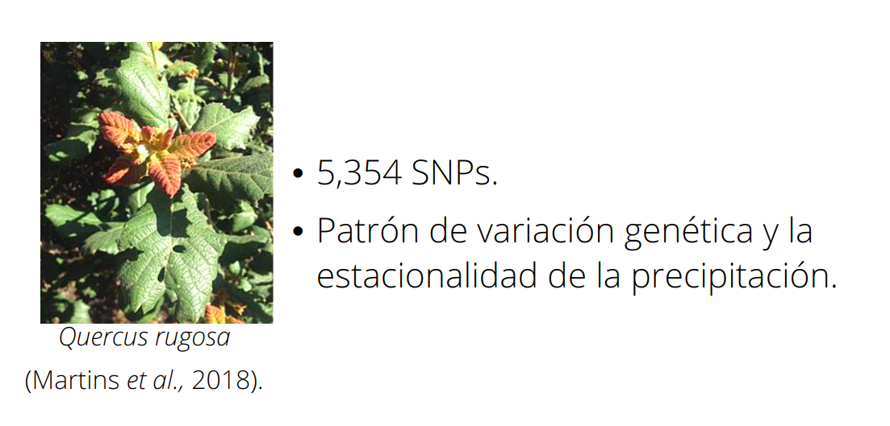
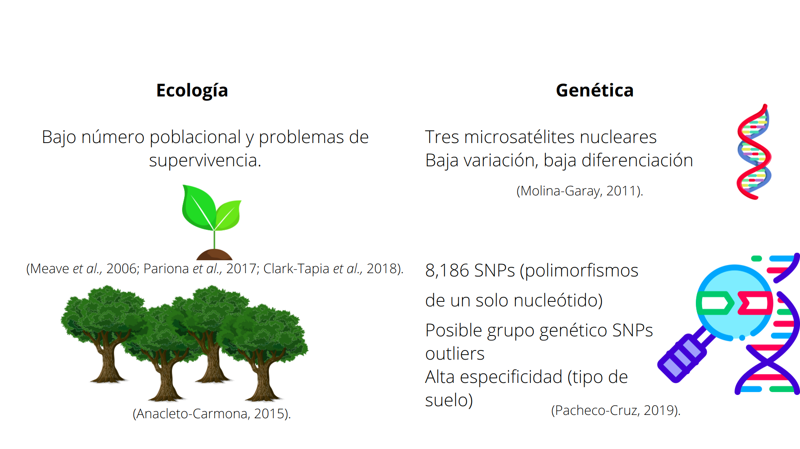
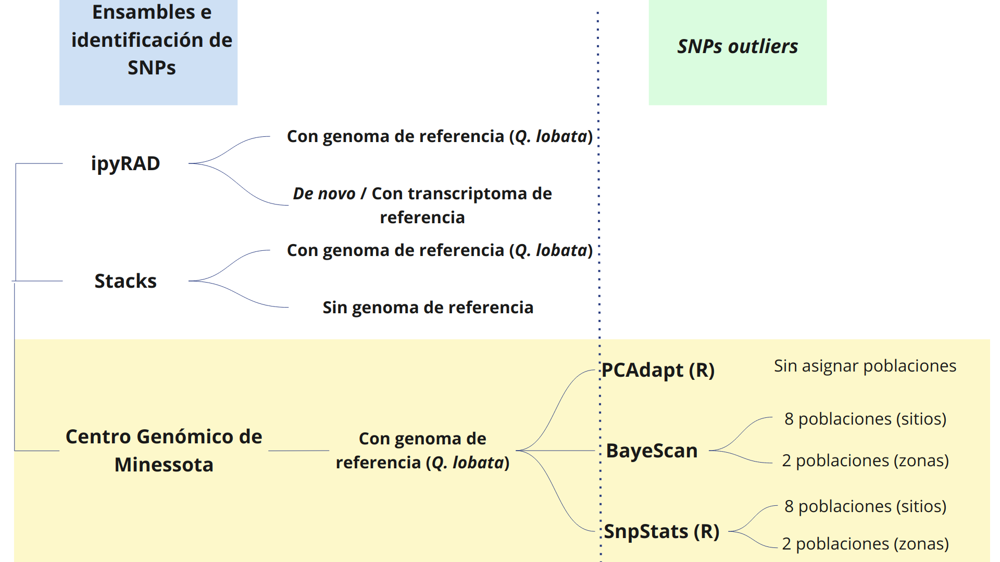

## Tutoral 1

## Análisis de la variación genómica funcional y su asociación con variables ambientales en _Quercus macdougallii_ Martínez (Fagaceae), encino endémico de Oaxaca.

<p align="center">

</p>


### Alumna: Nelly J. Pacheco Cruz

### Tutor principal: Dr. Jorge E. Campos Contreras
### Miembros del Comité Tutor:
### - Dr. Jorge Ciros Pérez 
### - Dr. Juan P. Jaramillo Correa

* * *
# 1. Introducción 

## Los bosques templados

- Importantes reservorios de biomasa y biodiversidad

- Servicios ecológicos

- Patrimonio biocultural

([Cavender-Bares, 2016](https://www.cbs.umn.edu/sites/cbs.umn.edu/files/public/downloads/2016.cavender.journal.ios%2327.pdf); [Cavender-Bares, 2019](https://nph.onlinelibrary.wiley.com/doi/full/10.1111/nph.15450))

<p align="center">

</p>


Adaptación de especies arbóreas frente al Cambio Climático ([IPCC, 2007](https://www.ipcc.ch/report/ar4/syr/))

* * *
## Encinos

 - A nivel mundial se estiman entre 400 y 500 especies.
<p align="center">

</p>

Distribución geográfica de las ocho secciones del género *Quercus* ([Denk *et al.,* 2017](https://link.springer.com/chapter/10.1007/978-3-319-69099-5_2)).

- México es considerado uno de los más grandes centros de diversificación del género.
- Se estiman 150 especies aprox.
- Con 76 especies endémicas aprox.
- Oaxaca es consierado un hotspot

<p align="center">

</p>


* * *
## *Quercus macdougallii* Martínez (1963)

```
├── Orden: Fagales
│   └── Familia: Fagaceae
│         └── Género: Quercus  
│               └── Subgénero: Quercus
│                      └── Sección: Quercus (encinos blancos)
│                              └── Especie: Q. macdougallii
```
Nombres comunes en la zona donde se distribuye:

- **_Yaa dua yu_** ( Zapoteco)  
- **_’Ma kue_** (Chinanteco)

Encino endémico en peligro ([UICN, 2020](https://www.iucnredlist.org/es/species/32765/2823034)) y amenazado ([NOM-059, 2019](http://diariooficial.gob.mx/normasOficiales.php?codp=8007&view=si#)).

<p align="center">

</p>

Individuos adultos de _Q. macdougallii_: a) Hojas de un individuo adulto; b) Hojas de un individuo con características arbustivas en el sitio MC; c) Hojas con evidencia de herbivoría; d) Individuos adultos en el sitio PZ (aprox. 15 m de altura); e) Individuo con apariencia arbustiva en el sitio CZ (aprox. 3 m de altura); f) Individuo adulto en el sitio MB cubierto de musgos y epífitas.


<p align="center">

</p>

Presenta una distribución restringida a la Sierra Norte de Oaxaca,  también conocida como Sierra Juárez ([Valencia, 2004](https://www.botanicalsciences.com.mx/index.php/botanicalSciences/article/view/1692); [Romero-Rangel _et al.,_ 2015](https://www.iztacala.unam.mx/coordinacioneditorial/vinculos/servicio/libreria/catalogo.php#indice)).

* * *
# 2. Antecedentes

<p align="center">

</p>

[Martínez, _et al.,_ 2018. Landscape genomics provides evidence of climate‐associated genetic variation in Mexican populations of _Quercus rugosa_](https://onlinelibrary.wiley.com/doi/full/10.1111/eva.12684)

De la especie:
<p align="center">

</p>

* * *
# 3. Justificación

<p align="center">

</p>

(Rellstab _et al.,_ 2016; Sork _et al.,_ 2016a; Sork _et al.,_ 2016b; Gugger _et al.,_ 2017; Pina-Martins _et al.,_ 2019).

<p align="center">

</p>

(Müller y Gailing, 2019; Yang _et al.,_ 2018).


* * *
# 4. Hipótesis


En especies arbóreas de vida larga se han reportado genes asociados a una respuesta adaptativa frente a cambios climáticos, por lo cual, se espera que _Q. macdougallii_, encino endémico, presente genes asociados a variables ambientales, como la temperatura, la precipitación y la edafología.


<p align="center">

</p>


* * *
# 5. Objetivos

<p align="center">

</p>

* * *
# 6. Materiales y métodos

### Área de estudio


|| |
|--------|--------|
|<p align="center">  </p>| <p align="center">  </p>|

Esta área se encuentra en una zona de transición entre dos provincias biogeográficas, la Sierra Madre del Sur y la Provincia de Oaxaca.


<p align="center">

</p>

Sitios de muestreo: a) Cerro Zacate; b) Carretera Oaxaca-Tuxtepec Km 175; c) Cerro Mirador; d) Parte baja del Cerro Mirador; e) Entrada a Comaltepec a partir de la Carretera Federal Oaxaca-Tuxtepec; f) Laguna del Sacrificio; g) Camino Real; h) Pozuelos.

- - -
### Diagrama de flujo general

<p align="center">


</p>

([Ay y Arnosti, 2011](https://www.tandfonline.com/doi/abs/10.3109/10409238.2011.556597); [Cokus _et al.,_ 2015](https://bmcgenomics.biomedcentral.com/articles/10.1186/s12864-015-1761-4); [Fitzpatrick y Keller, 2015](https://onlinelibrary.wiley.com/doi/abs/10.1111/ele.12376); [Schmidt _et al.,_ 2015](https://www.sciencedirect.com/science/article/abs/pii/S0378112714006872); [Rellstab _et al.,_ 2016](https://onlinelibrary.wiley.com/doi/abs/10.1111/mec.13889); [Sork _et al.,_ 2016](https://academic.oup.com/g3journal/article/6/11/3485/6031119?login=true); [Caldu-Primo _et al.,_ 2017](https://www.frontiersin.org/articles/10.3389/fgene.2017.00045/full); [Martins _et al.,_ 2018](https://onlinelibrary.wiley.com/doi/full/10.1111/eva.12684); [Pina-Martins _et al.,_ 2019](https://onlinelibrary.wiley.com/doi/abs/10.1111/gcb.14497)).

 Fuentes de bases de datos:
 [NCBI:genoma de _Q. lobata_](https://www.ncbi.nlm.nih.gov/genome/44710)     
 [HardWood Genomics Project](https://hardwoodgenomics.org/bio_data/25)       
 [Oak Genome Sequencing](http://www.oakgenome.fr/)
 

### Ensambles e identificación de _SNPs outliers_

<p align="center">

</p>


- En la _pipeline_ del [Centro Genómico de Minessota](https://genomics.umn.edu/services/gbs) se utilizaron los programas: Illumina bcl2fastq, Trimmomatic, bwa, un genoma de referencia híbrido, creado entre el genoma de _Q. lobata_ (Sork _et al.,_ 2016) y las lecturas consenso de los individuos muestreados.      
Con Freebayes se generó un VCF y se realizaron filtros con VCFTools.

- Para las pruebas con otras _pipelines_ se comenzó con el análisis de visualización y limpieza de las secuencias de los 79 individuos ya se realizó con los programas FastQC y Trimmomatic. La bitacorá se puede consultar [aqui](../results/workflow_first_part.md).En promedio se obtuvieron 700 mil lecturas por muestra, con un promedio en puntuaciones de calidad ≥ Q30.

- El análisis con la _pipeline_ de **ipyRAD** esta en proceso, por el momento ya se hizo la [primer prueba](../results/Quercus_mac_lobata_ipyrad.md) con los parámetros de _default_ del programa y con el genoma de referencia de _Q. lobata_ encontrado en [HardWood Genomics Project](https://hardwoodgenomics.org/bio_data/25), y se han identificado 191,153 SNPs pero con bajas frecuencias, lo que procedería es hacer un filtro para excluir aquellos con altos niveles de _Ns_ o datos faltantes.


* * *
# 7. Resultados preliminares

A partir del VCF con los 8,186 SNPs identificados en Pacheco-Cruz (2019).

#### PCAdapt
<p align="center">

</p>


<p align="center">

</p>


<p align="center">

</p>


#### BayeScan
<p align="center">

</p>


<p align="center">


</p>

#### SnpStats

<p align="center">


</p>


A partir de estos tres métodos se generaron cinco bases de datos con los ID de cada SNP outlier y a partir de un diagrama de Venn se identificaron cuantos de ellos se compartían entre las cinco bases de datos.


<p align="center">

</p>

Diagrama de Venn entre las cinco bases de datos generadas en los tres métodos para identificación de SNPs outliers. 


El único SNP outlier que comparten las cinco bases de datos es el **“SSCAFFOLD-14_28801306”**, en donde se identificó el cambio entre citosina y adenina, 

Su secuencia, tomando 100 pb en ambas direcciones a partir del SNP, es:
`TATGTTTTTCAAGAATTTCAAACAATCTATTATCATTCAAAAAAGATAGAAAACGTATAGCTAGACTTCTTTCCTCCTCTGGCTTATCAAATGAAAGAGCMTTTTCTCCCATTAATAACTCTACGAGGACCACTCCAAAGCTATAAACATCACTTTTCTCTGTCAATTGACTTGTTTGCATGTATTCAGGATCCAAGTATC`

Al hacer un BLAST en NCBI se pudo identificar una similitud con el receptor putativo de quinasa asociado a pared 16 PREDICHO para _Q. lobata_ (LOC115985898), mRNA

>Sequence ID: XM_031108791.1Length: 2253

El cambio de entre citosina y adenina **(C:A = M)** puede afectar la traducción, pasando de prolina a histidina en esta región. 


La familia de genes de _wall-associated kinase_ (WAK), una de las familias de genes _receptor-like kinase_ (RLK) en plantas, desempeña funciones importantes en la expansión celular, la resistencia a patógenos y la tolerancia al estrés por metales pesados en Arabidopsis thaliana ([Zhang _et al.,_ 2005](http://www.plantphysiol.org/content/139/3/1107.short))


_Pendiente:_ Aún faltan más análisis para corroborar esto además del otro enfoque donde se buscará si en genes previamente identificados para otros encinos como genes candidatos a adaptación, hay variaciones identificadas en las secuencias de *Q. macdougallii*.

**Actividad complementaria para el semestre 2021-2: Genética del paisaje**


