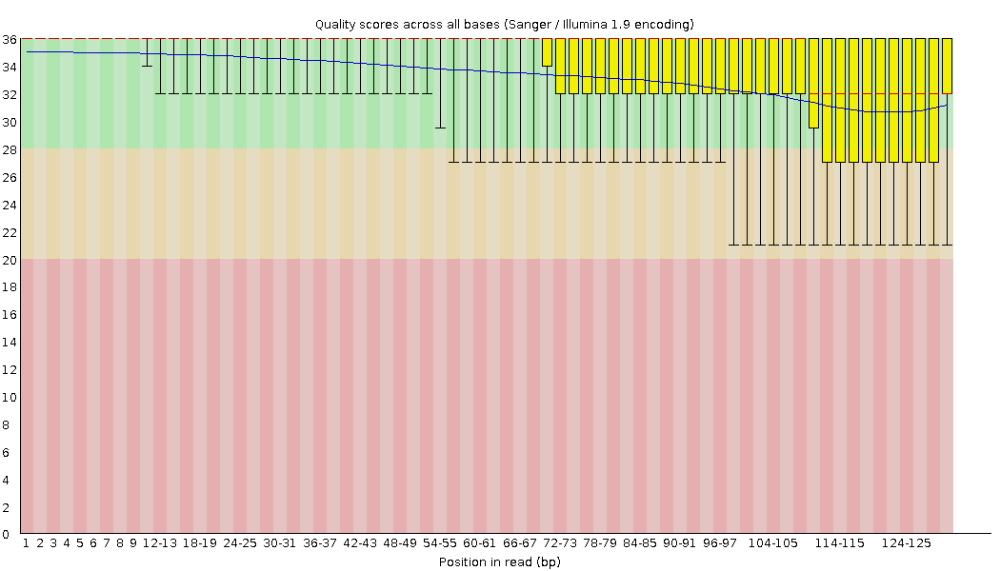

# Primera parte 
## 1. Visualización y filtrado

Para visualizar la calidad de las secuencias se usó el programa `FastQC` 
Primero debemos descomprimir las secuencias que estan en formato `fastq.gz`
Estamos en la carteta `/data/raw`
``` {bash}
gzip -d *.gz
```
Creamos una carpeta donde guardaremos los resultados en formatos `.html` y en archivos compromidos en `.zip`
```
mkdir ../0.1_FastQC
```

Para visualizar la calidad de las secuencias:
```
./fastqc ../../data/raw/*.fastq -o ../../data/0.1_FastQC
```

Visualizamos los archivos `.html` en donde encontraremos una serie de parámetros que nos indican la calidad de las secuencias y nos ayudarán a decidir que parámetros para filtrar y cortar utilizaremos en el siguiente paso.

A continuación se muestran los resultados obtenidos para la muestra CR_01, del sitio Camino Real en la zona Sur. 

<p align="center">


</p>

Podemos observa como decae la calidad al final de las lecturas, específicamente a partir de la base 105 (*reads*)


Una combinación de parámetros sería cortar a partir de la base 10 hasta la 105 con un phred score de 33.

Desde la carpeta bin se corrio en la terminal los siguientes script, primero `$ ./2.0_Trimmomatic`

``` 
#!/bin/bash 
#############################

#Creamos la carpeta para los archivos de FastQC para visualizar los archivos fastq filtrados y cortados (trimmomatic)

mkdir ../data/0.3_FastQC

#### TRIMMOMATIC ####

#### Ponemos los valores con los cuales vamos a cortar

for i in CR_01_S115 CR_0isualización y filtrado2_S127 CR_03_S139 CR_04_S151 CR_05_S163 CR_06_S175 CR_07_S186 CR_08_S104 CR_09_S116 CR_10_S128 CY_01_S170 CY_02_S181 CY_03_S99 CY_04_S111 CY_05_S123 CY_06_S135 CY_07_S147 CY_08_S159 CY_09_S171 CY_10_S182 CZ_01_S100 CZ_02_S112 CZ_03_S124 CZ_04_S136 CZ_05_S148 CZ_06_S160 CZ_07_S172 CZ_08_S183 CZ_09_S101 CZ_10_S113 LS_01_S140 LS_02_S152 LS_03_S164 LS_04_S176 MB_01_S95 MB_02_S107 MB_03_S119 MB_04_S131 MB_05_S143 MB_06_S155 MB_07_S167 MB_08_S178 MB_09_S96 MB_10_S108 MC_01_S120 MC_02_S132 MC_03_S144 MC_04_S156 MC_05_S168 MC_06_S179 MC_07_S97 MC_08_S109 MC_09_S121 MC_10_S133 MT_01_S145 MT_02_S157 MT_03_S169 MT_04_S180 MT_05_S98 MT_06_S110 MT_07_S122 MT_08_S134 MT_09_S146 MT_10_S158 PZ_01_S125 PZ_02_S137 PZ_03_S149 PZ_04_S161 PZ_05_S173 PZ_06_S184 PZ_07_S102 PZ_08_S114 PZ_09_S126 PZ_10_S138 PZ_11_S150 PZ_12_S162 PZ_13_S174 PZ_14_S185 PZ_15_S103 ; do

	trimmomatic SE -threads 10 -phred33 ../data/raw/$i*.fastq ../data/0.2_Trimmomatic/$i.trimmed.fastq.gz LEADING:33 TRAILING:33 SLIDINGWINDOW:4:15 CROP:140 HEADCROP:10 MINLEN:80 
    
    ./FastQC/fastqc ../data/0.2_Trimmomatic/$i*.fastq.gz -o ../data/0.3_FastQC ;

done

```
Visualizamos la calidad de las secuencias de la muestra CR_01

<p align="center">




</p>

Notas extras:
- Para usar FastQC se descargo del sitio https://www.bioinformatics.babraham.ac.uk/projects/download.html#fastqc
 La versión de FastQC que se utilizó fue **0.11.9**

- Para instalar Trimmomatic se utilizó el comando de conda
 `conda install -c bioconda/label/broken trimmomatic `
 De la página https://anaconda.org/bioconda/trimmomatic
 Previamente ya se había instalado cohttps://hardwoodgenomics.org/Genome-assembly/1963056?tripal_pane=group_downloadsnda por lo que resulto más sencillo instalar Trimmonatic directamente con esa línea de código.
 La versión de Trimmomatic que se utilizó fue **0.38**
 Aquí esta un manual de como utilizar el programa http://www.usadellab.orgisualización y filtrado/cms/uploads/supplementary/Trimmomatic/TrimmomaticManual_V0.32.pdf

* * *
## 2. Ensamble a genoma de referencia con ipyRAD

Posteriormente, estas lecturas ya cortadas y filtradas se utilizaron en la *pipeline* de **ipyRAD** con **jupyter-notebook**, para un ensamble al genoma de referencia de *Q. lobata* (https://hardwoodgenomics.org/Genome-assembly/1963056?tripal_pane=group_downloads).


